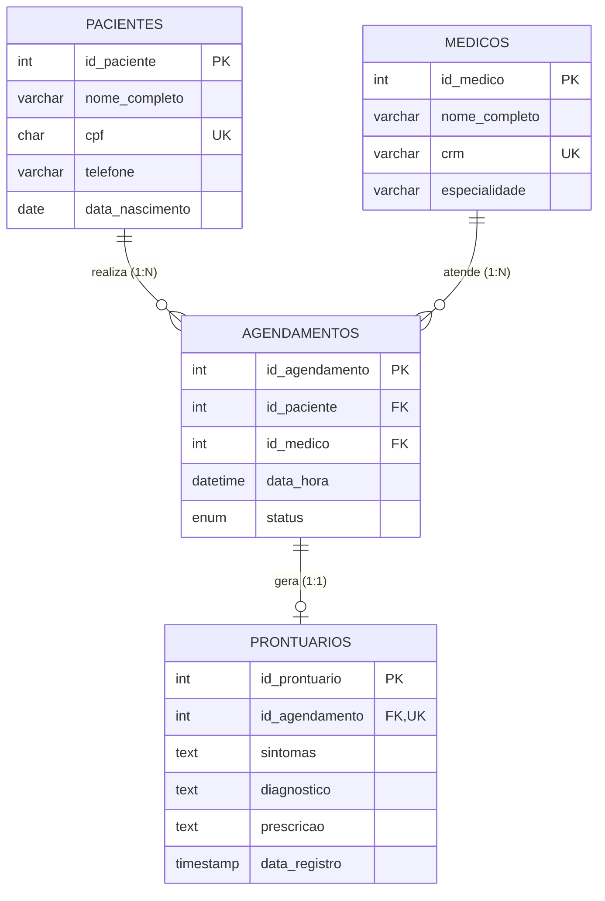

# Refatoração de Banco de Dados — Clínica Médica
Diagrama Entidade-Relacionamento (MER) da nova estrutura normalizada:

```mermaid
erDiagram
   PACIENTES {
       int id_paciente PK
       varchar nome_completo
       char cpf UK
       varchar telefone
       date data_nascimento
   }
   MEDICOS {
       int id_medico PK
       varchar nome_completo
       varchar crm UK
       varchar especialidade
   }
   AGENDAMENTOS {
       int id_agendamento PK
       int id_paciente FK
       int id_medico FK
       datetime data_hora
       enum status
   }
   PRONTUARIOS {
       int id_prontuario PK
       int id_agendamento FK, UK
       text sintomas
       text diagnostico
       text prescricao
       timestamp data_registro
   }
   PACIENTES ||--o{ AGENDAMENTOS : "realiza (1:N)"
   MEDICOS ||--o{ AGENDAMENTOS : "atende (1:N)"
   AGENDAMENTOS ||--o| PRONTUARIOS : "gera (1:1)"
```
tem menu de contexto
